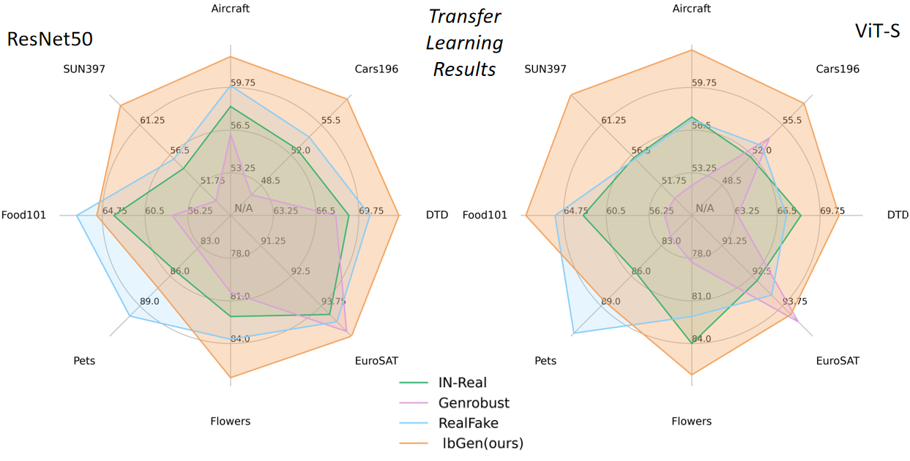

<div align='center'>
<h1>  Low-Biased General Annotated Dataset Generation</h1> 
</div>

<p align="center">
  <a href="https://arxiv.org/abs/2412.10831">
    
  </a>
  <a href="https://www.xiaohongshu.com/user/profile/60195f8f0000000001009cc6">
    
  </a>
</p>

<div align="center">
    Dengyang Jiang<sup>1*</sup> &ensp; <b>&middot;</b> &ensp; 
    Haoyu Wang<sup>1*</sup> &ensp; <b>&middot;</b> &ensp;
    Lei Zhang<sup>1†</sup> &ensp; <b>&middot;</b> &ensp;
    Wei Wei<sup>1</sup> <br>
    Guang Dai<sup>2</sup> &ensp; <b>&middot;</b> &ensp;
    Mengmeng Wang<sup>3</sup> &ensp; <b>&middot;</b> &ensp;
    Jingdong Wang<sup>4</sup> &ensp; <b>&middot;</b> &ensp;
    Yanning Zhang<sup>1</sup><br>
    <sup>1</sup>Northwestern Polytechnical University &emsp; 
    <sup>2</sup>SGIT AI Lab, State Grid Corporation of China &emsp;<br>
    <sup>3</sup>Zhejiang University of Technology &emsp;
    <sup>4</sup>Baidu Inc. &emsp;<br>
    <sup>*</sup>Equal Contribution &emsp;
    <sup>†</sup>Corresponding Author
</div>

<h3 align="center">[<a href="https://arxiv.org/abs/2412.10831">paper</a>]</h3>

<div align="center">
  
</div>


We introduce an low-biased general annotated dataset generation (**lbGen**) framework which  directly generates low-biased images with
category annotations. \
We find that pre-training on our generated dataset can significantly improve the generalization ability of the models under the cross-category or cross-domain scenarios.

<div align="center">
  
</div>


## 👓 1.Environment Setup

```bash
cd your_path/lbGen-main
conda create -n lbgen python=3.11 -y
conda activate lbgen
pip install -r debias.txt
```

## 📡 2.Training

Using this repo, you can obtain lbGen generator by fine-tuning the diffusion models (sd15). 
By default, we use a single machine with 8 gpus to train the model, 
and the checkpoints will be saved in 'your_path/lbGen-main/training/output/lbGen/'.

```bash
cd training
bash scripts/sd15.sh
```

## 📚 3.Data Generation

After fine-tuning the diffusion model, you can generate the dataset. By
default, we use 4 gpus to generate the dataset and the whole data will be saved in 'your_path/lbGen-main/data_gen/IN1K'.

```bash
cd /code/data_gen
python sd15gen.py
```


## 🪩 4.Note

It's possible that this code may not accurately replicate the results outlined in the paper due to potential human errors during cleaning the code and the differences between current available sd1.5 and previous runwayml version. \
Feel free to inform us if you encounter any issues. 

## 🤝 5.Acknowledgement

This code is mainly built upon [diffusers](https://github.com/huggingface/diffusers) and [CoMat](https://github.com/CaraJ7/CoMat). Thank their open-source!

## 💚 6.Citation

If you find lbGen useful for your research and applications, please consider starring this repository and citing:
```
@article{jiang_debias,
  title={Unbiased General Annotated Dataset Generation},
  author={Jiang, Dengyang and Wang, Haoyu and Zhang, Lei and Wei, Wei and Dai, Guang and Wang, Mengmeng and Wang, Jingdong and Zhang, Yanning},
  journal={arXiv preprint arXiv:2412.10831},
  year={2024}
}
```
